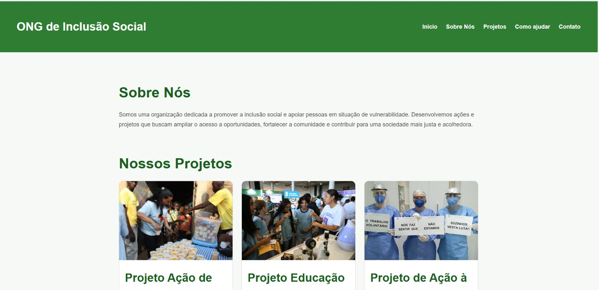
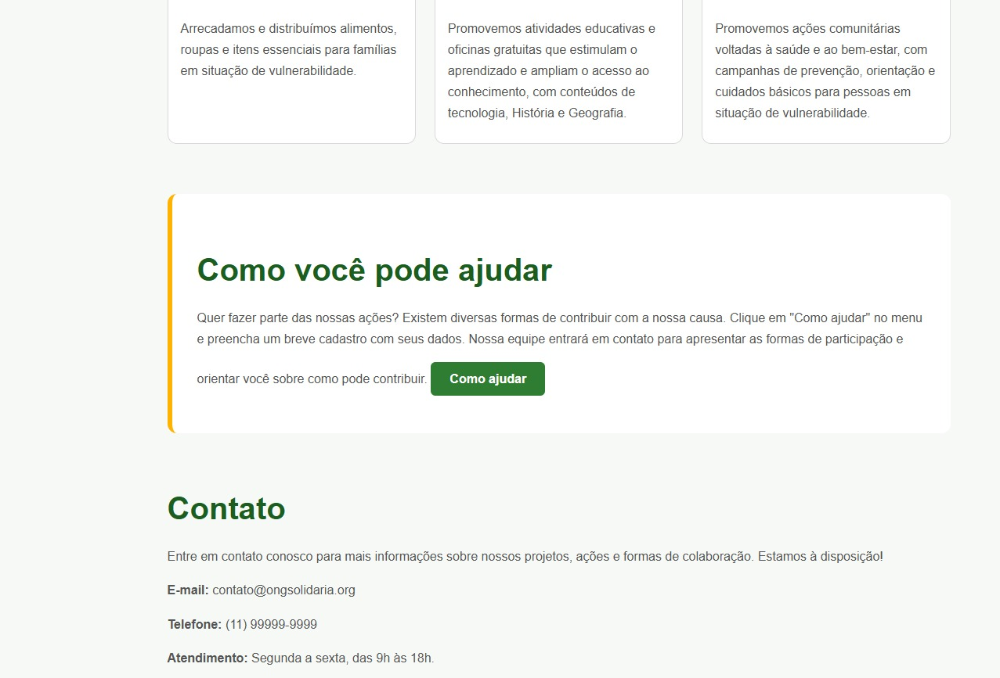
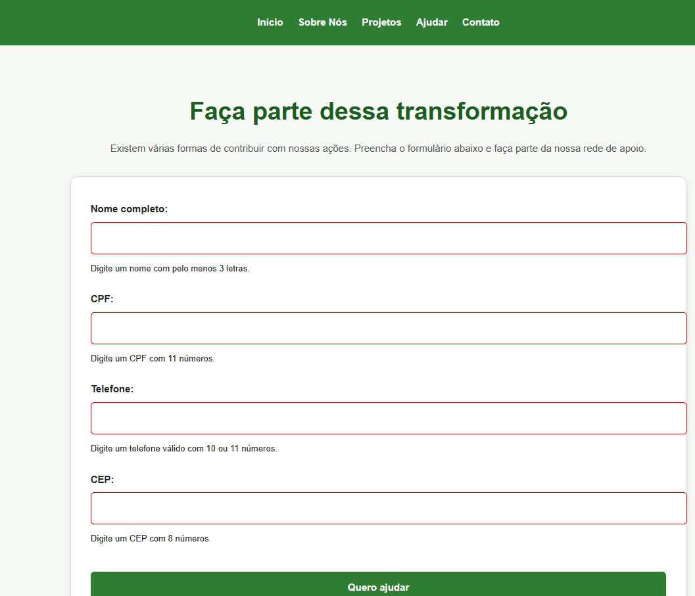

# 🌱 ONG Solidária — Inclusão Social

> **Projeto acadêmico e fictício desenvolvido durante a graduação em Análise e Desenvolvimento de Sistemas.**

## 🖥️ Prévia do projeto

A aplicação foi desenvolvida para representar uma ONG fictícia de inclusão social, apresentando seus projetos, informações institucionais, formas de contato e um formulário para pessoas interessadas em ajudar.

### 1. 🏠 Início e projetos

A página inicial apresenta a proposta da ONG e seus principais projetos sociais.



---

### 2. 📋 Informações dos projetos e contato

Área destinada à apresentação das ações realizadas pela ONG e às informações para entrar em contato.



---

### 3. 🤝 Formulário de ajuda

Formulário desenvolvido para pessoas interessadas em contribuir com as ações da ONG. Os dados inseridos são submetidos a validações realizadas através de JavaScript.



---

### 4. 🔻 Rodapé

Rodapé da aplicação com as informações finais do projeto e elementos de navegação.


---

# 📌 Sobre o projeto

O **ONG Solidária** é um projeto acadêmico desenvolvido durante a graduação em **Análise e Desenvolvimento de Sistemas**, com o objetivo de aplicar conhecimentos de desenvolvimento **front-end**, organização de código, responsividade, acessibilidade, validação de formulários e versionamento.

A aplicação representa uma **ONG fictícia de inclusão social**, criada a partir da reflexão sobre as dificuldades que muitas organizações podem enfrentar para estabelecer uma presença digital própria.

A proposta demonstra como uma aplicação web pode auxiliar uma organização social na apresentação de seus projetos, divulgação de ações, comunicação com a comunidade e captação de pessoas interessadas em contribuir.

> ⚠️ **Importante:** este é um projeto exclusivamente acadêmico e fictício. A ONG apresentada não representa uma organização real.

---

# 🎯 Objetivos

O projeto foi desenvolvido com os seguintes objetivos:

- Criar uma interface web para uma ONG fictícia;
- Apresentar projetos e ações sociais;
- Facilitar o contato com pessoas interessadas em contribuir;
- Desenvolver um formulário com validações;
- Aplicar conceitos de HTML5 semântico;
- Criar uma identidade visual utilizando CSS;
- Aplicar princípios de responsividade;
- Utilizar JavaScript para interatividade;
- Trabalhar com módulos JavaScript;
- Utilizar `localStorage` para armazenamento de dados;
- Implementar animações com a biblioteca AOS;
- Utilizar Git e GitHub para versionamento;
- Aplicar conceitos de Git Flow durante o desenvolvimento.

---

# 💻 Tecnologias utilizadas

## HTML5

Utilizado para estruturar as páginas e os conteúdos da aplicação.

Foram utilizados conceitos como:

- Estrutura semântica;
- Cabeçalho e navegação;
- Seções de conteúdo;
- Projetos sociais;
- Formulários;
- Imagens com atributo `alt`;
- Campos de entrada;
- Botões.

## CSS3

Responsável pela apresentação visual da aplicação.

Foram utilizados:

- Variáveis CSS;
- Design System;
- Grid Layout;
- Flexbox;
- Responsividade;
- Cores;
- Tipografia;
- Espaçamentos padronizados;
- Estados de `hover`;
- Estados de `focus`;
- Estilização de formulários;
- Classes para campos válidos e inválidos.

## JavaScript

Utilizado para implementar a interatividade da aplicação, incluindo:

- Navegação dinâmica;
- Renderização de conteúdo;
- Manipulação do DOM;
- Eventos de clique;
- Validação de formulários;
- Controle de rotas;
- Criação dinâmica dos projetos;
- Armazenamento de dados;
- Utilização de módulos JavaScript.

## AOS

A biblioteca **AOS (Animate On Scroll)** foi utilizada para adicionar animações aos elementos durante a navegação.

O projeto utiliza:

```javascript
AOS.init();
```

e atualiza as animações após a renderização dinâmica utilizando:

```javascript
AOS.refresh();
```

## LocalStorage

O `localStorage` foi utilizado para armazenar e recuperar os dados cadastrados no navegador.

As principais funções utilizadas são:

```javascript
salvarCadastro();
obterCadastro();
```

Os dados são convertidos para JSON durante o armazenamento e posteriormente recuperados através do `JSON.parse()`.

## Git e GitHub

Utilizados para:

- Controle de versões;
- Registro das alterações;
- Organização do desenvolvimento;
- Armazenamento do código-fonte;
- Publicação do projeto.

---

# 📂 Estrutura do projeto

```text
ong-solidaria/
│
├── img/
│   ├── acao_alimentos.jpg
│   ├── acao_saude.jpg
│   ├── educacao.jpg
│   ├── inicio-projetos.png
│   ├── informacoes-contato.png
│   ├── formulario-ajuda.png
│   └── rodape.png
│
├── js/
│   ├── projeto.js
│   ├── storage.js
│   └── validacao.js
│
├── ajuda.html
├── index.html
├── README.md
├── script.js
└── style.css
```

## 📁 `img/`

Armazena as imagens utilizadas na aplicação, incluindo as imagens dos projetos sociais e as capturas de tela utilizadas na documentação.

## 📁 `js/`

Contém os arquivos JavaScript responsáveis por funcionalidades específicas:

- `projeto.js` — criação dinâmica dos projetos;
- `storage.js` — armazenamento e recuperação dos dados;
- `validacao.js` — validação e comportamento do formulário.

## 📄 `index.html`

Página principal da aplicação, responsável pela estrutura inicial e navegação.

## 📄 `ajuda.html`

Página destinada à apresentação das formas de contribuição e ao formulário de ajuda.

## 📄 `script.js`

Arquivo JavaScript principal responsável pela navegação, renderização dinâmica e inicialização das funcionalidades.

## 📄 `style.css`

Folha de estilos responsável pelo Design System, layout, cores, tipografia, formulários e responsividade.

---

# 🌱 Projetos sociais

A aplicação apresenta três projetos sociais fictícios.

## 🍚 Ação de Alimentos

Projeto voltado à distribuição de alimentos para famílias em situação de vulnerabilidade.

## 📚 Educação

Projeto direcionado à educação e inclusão social, buscando contribuir para o acesso ao conhecimento.

## ❤️ Ação de Saúde

Projeto voltado à orientação e ao atendimento da comunidade, promovendo ações relacionadas à saúde e ao bem-estar.

Os projetos são armazenados em um array de objetos JavaScript contendo título, descrição e imagem.

---

# ⚙️ Funcionalidades

## 🧭 Navegação dinâmica

A aplicação utiliza JavaScript para controlar a navegação através das rotas definidas no projeto.

A função `renderizar()` verifica se a rota solicitada existe e insere o conteúdo correspondente no elemento principal da aplicação.

Caso a rota não exista, é apresentada uma mensagem informando que a página não foi encontrada.

## 🃏 Criação dinâmica dos projetos

Os projetos são armazenados em um array JavaScript.

A função `criarProjetos()` percorre os dados utilizando `map()` e gera dinamicamente os elementos HTML correspondentes.

Cada projeto possui:

- Título;
- Descrição;
- Imagem;
- Texto alternativo (`alt`).

## 📝 Formulário

A página de ajuda possui um formulário destinado às pessoas interessadas em participar ou contribuir com as ações da ONG.

## ✅ Validação

O formulário possui validações desenvolvidas em JavaScript.

São verificados aspectos como:

- Preenchimento dos campos;
- Quantidade de caracteres;
- Quantidade de números;
- Formato esperado dos dados;
- Estado válido ou inválido dos campos.

Para representar visualmente esses estados, são utilizadas as classes:

```css
.campo-invalido


e:

```css
.campo-valido
```

Também são utilizadas mensagens de validação para orientar o utilizador durante o preenchimento.

## 💾 Armazenamento

Os dados cadastrados podem ser armazenados no navegador utilizando `localStorage`.

A função:

```javascript
salvarCadastro()
```

é responsável por salvar os dados.

Já:

```javascript
obterCadastro()
```

é utilizada para recuperar as informações armazenadas.

---

# 🎨 Design System

O projeto possui um Design System desenvolvido utilizando variáveis CSS.

## 🎨 Cores

| Variável | Cor | Utilização |
|---|---|---|
| `--cor-primaria` | `#2E7D32` | Elementos principais |
| `--cor-primaria-escura` | `#1B5E20` | Títulos e rodapé |
| `--cor-primaria-clara` | `#66BB6A` | Variações da cor principal |
| `--cor-secundaria` | `#1976D2` | Elementos secundários |
| `--cor-secundaria-clara` | `#64B5F6` | Variações secundárias |
| `--cor-destaque` | `#FFB300` | Destaques e interações |
| `--cor-fundo` | `#F7F9F7` | Fundo da aplicação |
| `--cor-branco` | `#FFFFFF` | Cards e elementos claros |
| `--cor-texto` | `#212121` | Texto principal |
| `--cor-texto-secundario` | `#555555` | Texto secundário |
| `--cor-borda` | `#DADADA` | Bordas |

## 🔤 Tipografia

Foram definidos diferentes tamanhos de fonte:

```text
--fonte-xs
--fonte-sm
--fonte-md
--fonte-lg
--fonte-xl
```

## 📏 Espaçamentos

O projeto utiliza uma escala padronizada:

```text
--espaco-1
--espaco-2
--espaco-3
--espaco-4
--espaco-5
--espaco-6
--espaco-7
```

Essa organização permite manter maior consistência visual entre os elementos da interface.

---

# 📱 Responsividade

O projeto foi desenvolvido considerando diferentes tamanhos de tela.

As imagens utilizam:

```css
width: 100%;
```

e:

```css
object-fit: cover;
```

permitindo que sejam adaptadas ao espaço disponível.

O conteúdo principal também possui uma largura máxima, evitando que o texto ocupe uma área excessivamente extensa em telas maiores.

---

# ♿ Acessibilidade

Foram aplicadas práticas para melhorar a acessibilidade da aplicação, incluindo:

- Uso de HTML semântico;
- Hierarquia de títulos;
- Textos alternativos nas imagens;
- Contraste entre textos e fundos;
- Estados visuais de `hover` e `focus`;
- Labels nos campos do formulário;
- Mensagens de validação;
- Organização visual consistente.

---

# 🖼️ Imagens e otimização

As imagens dos projetos sociais estão armazenadas na pasta `img/`:

```text
acao_alimentos.jpg
acao_saude.jpg
educacao.jpg
```

As imagens foram dimensionadas através de CSS para ocupar adequadamente o espaço disponível nos cards.

Para uma futura versão de produção, seria possível otimizar ainda mais os recursos através de:

- Conversão para WebP;
- Compressão das imagens;
- Redimensionamento de acordo com o espaço de apresentação;
- Utilização de imagens responsivas.

---

# 🔀 Git Flow e versionamento

O desenvolvimento foi organizado utilizando **Git e GitHub** para controle de versões.

O **Git Flow** foi utilizado como referência para organizar o desenvolvimento das funcionalidades através de branches.

A estrutura pode ser representada da seguinte forma:

```text
main
 │
 └── develop
       │
       ├── feature/projetos
       ├── feature/formulario
       ├── feature/validacao
       └── feature/responsividade
```

As funcionalidades foram desenvolvidas separadamente e posteriormente integradas ao fluxo principal após testes e validações.

Essa organização permitiu manter o histórico do projeto estruturado e acompanhar as alterações realizadas durante o desenvolvimento.

---

# 🚀 Deploy

O projeto foi desenvolvido como uma aplicação front-end estática, utilizando HTML, CSS e JavaScript.

Por esse motivo, não existe dependência de um servidor *backend* para executar suas funcionalidades principais.

O código pode ser armazenado no GitHub e disponibilizado através do **GitHub Pages**, permitindo que a aplicação seja acessada por meio de um URL público.

---

# 📦 Minificação e otimização do código

O projeto não utilizou ferramentas como **Webpack** ou **Vite** para realizar uma etapa automatizada de *build* e minificação.

Portanto, não foi considerada uma percentagem específica de redução dos arquivos por meio de *bundling*.

Como melhoria futura, poderiam ser utilizadas ferramentas de *build* para:

- Agrupar arquivos;
- Minificar CSS;
- Minificar JavaScript;
- Reduzir o tamanho dos arquivos;
- Melhorar o desempenho de carregamento.

---

# ▶️ Como executar o projeto

Para executar o projeto localmente:

1. Faça o download ou clone o repositório.
2. Abra a pasta `ong-solidaria`.
3. Abra o projeto no Visual Studio Code.
4. Execute o `index.html` utilizando um servidor local, como o **Live Server**.
5. Navegue pelas páginas e funcionalidades da aplicação.

A utilização de um servidor local é recomendada para garantir o correto funcionamento dos módulos JavaScript e dos recursos utilizados pelo projeto.

---

# 🎓 Projeto acadêmico

Este projeto foi desenvolvido exclusivamente para fins acadêmicos como parte da formação em **Análise e Desenvolvimento de Sistemas**.

A ONG apresentada é fictícia e foi criada como uma proposta de aplicação prática dos conhecimentos adquiridos durante o desenvolvimento.

A ideia central foi utilizar a tecnologia para representar uma solução digital que poderia auxiliar organizações sociais na divulgação de seus projetos, ações e formas de contato com a comunidade.

---

# 👩‍💻 Autoria

**Rafaela Cabral**

Projeto desenvolvido para fins acadêmicos.

### Tecnologias

`HTML5` • `CSS3` • `JavaScript` • `Git` • `GitHub` • `AOS` • `LocalStorage`

---

## 📄 Licença

Este projeto foi desenvolvido para fins acadêmicos e educacionais.
